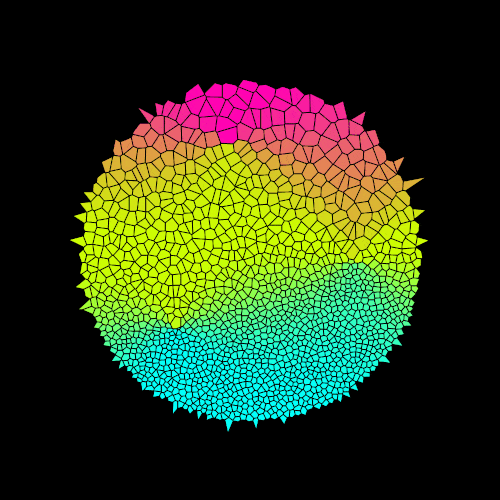
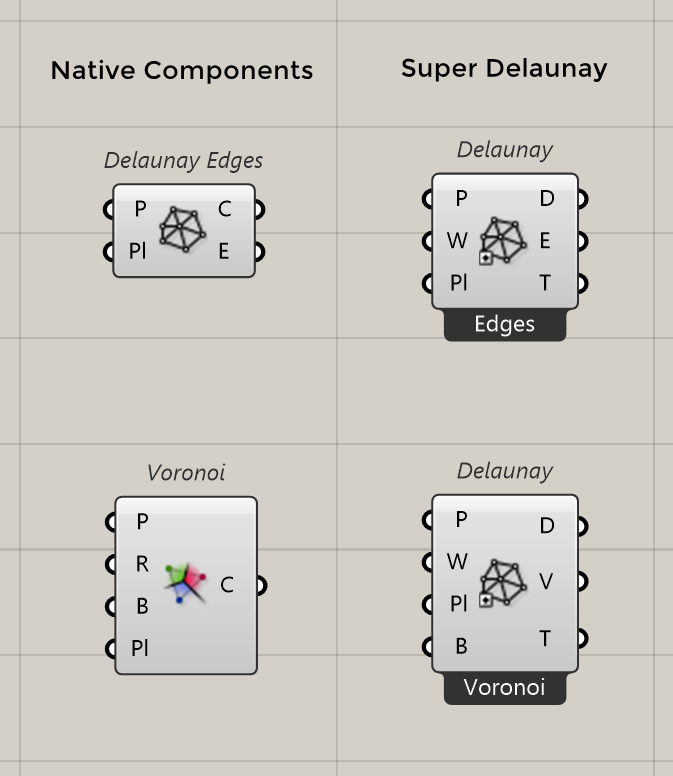
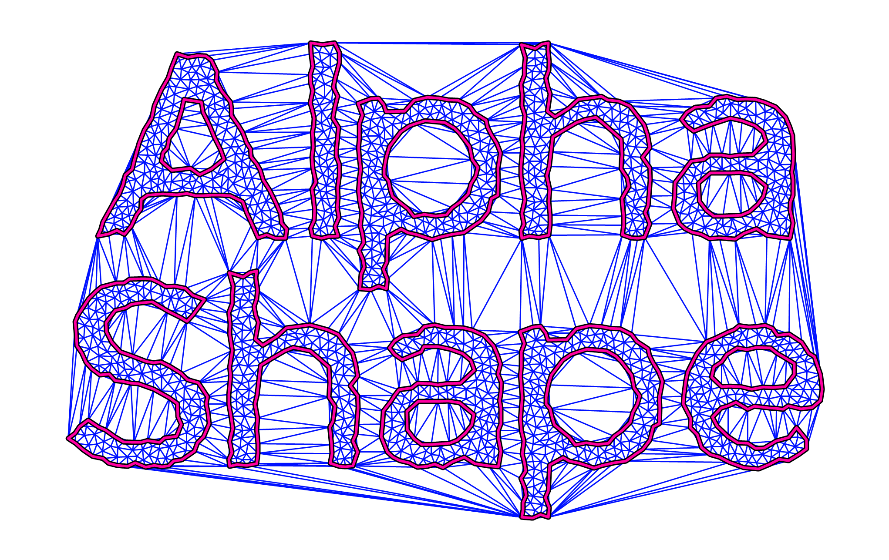
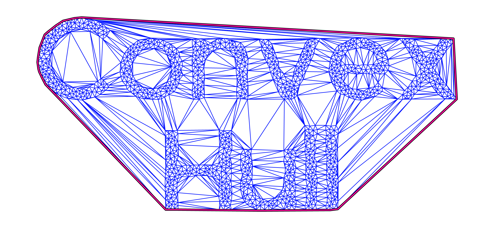
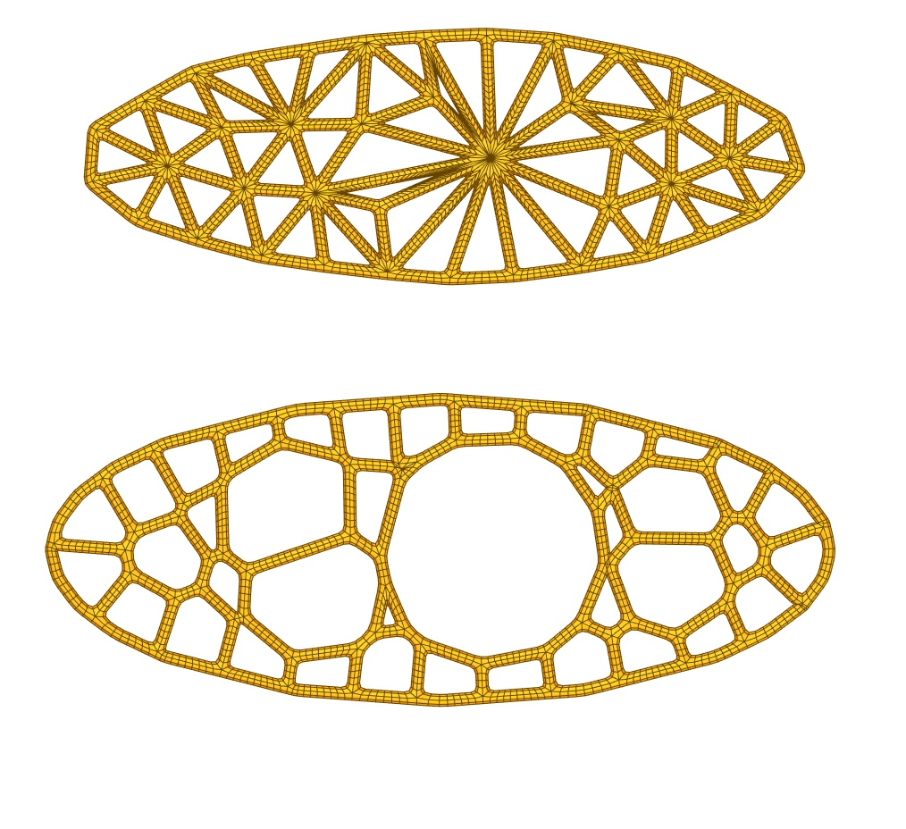
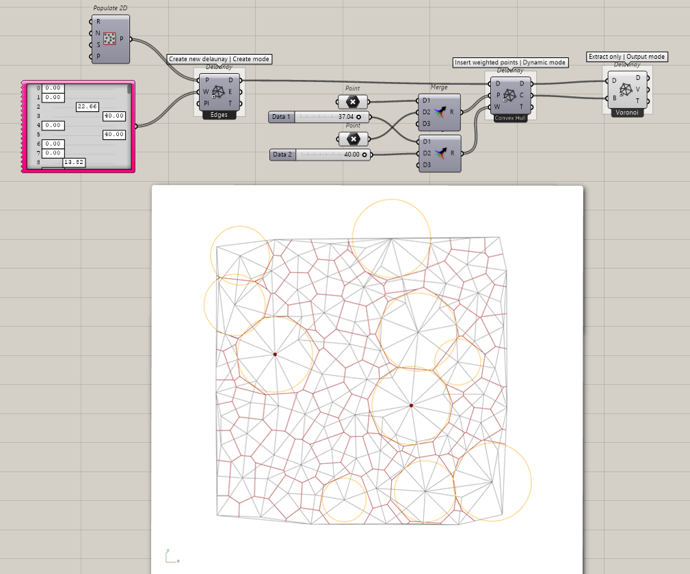
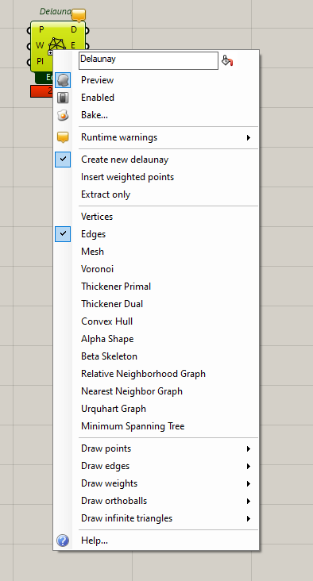

<h1 align="center"> Super Delaunay </h1>

 2D Weighted Voronoi / Power Diagrams for Grasshopper

 

#### Motivation 
I was developing a project that needed the weighted voronoi in 3d when I got tired of finding problems with degenerated cases,
so I decided to implement it in 2d assuming that it would be easier to understand its causes and I thought it would be a good plugin to share to the Grasshopper community.
It turns out that in 2d there are also many degenerate cases that no paper on this subject really goes into depth, so, to finish and share it,
this project has eaten up the time of my initial project and the moral is that before trying to reduce the complexity of a problem
to another more manageable, consider developing the tools necessary to understand in depth what your code does,
because this was what I needed to solve it in 2d and what I should have done with the initial project to not lose my goal. 

The bad name of the plugin is due to the fact that I didn't want to make a separate component for each utility but unify them all
 in one to minimize the impact on the component bar, and because all utilities are derived from this triangulation,
 which is actually known as power diagram, it is like the native Delaunay component but with super powers.
 

 

The project is open to implement any other algorithm that can be built with the power diagram.

#### Powers
##### [Power Diagram](https://en.wikipedia.org/wiki/Power_diagram) 

 

##### [Weighted Voronoi](https://en.wikipedia.org/wiki/Weighted_Voronoi_diagram) 

 

##### [Minimum Spanning Tree](https://en.wikipedia.org/wiki/Minimum_spanning_tree) 

 

##### [Relative Neighborhood Graph](https://en.wikipedia.org/wiki/Relative_neighborhood_graph) 

 
 
                                

##### [Urquhart Graph](https://en.wikipedia.org/wiki/Urquhart_graph)                                                                                           

 
 
                                

##### [Nearest Neighbor Graph](https://en.wikipedia.org/wiki/Nearest_neighbor_graph)                                                                                           

 
 
                                

##### [Beta Skeleton](https://en.wikipedia.org/wiki/Beta_skeleton)                                                                                         

 
 

                             
##### [Alpha Shape](https://en.wikipedia.org/wiki/Alpha_shape)                                                                                            

 
 
                                

##### [Convex Hull](https://en.wikipedia.org/wiki/Convex_hull)                                                                                            

 
 
                                

##### Primal and Dual Thickener                                                                                           

 
 

                     
#### Installation
0) Download the last release of *SuperDelaunay.gha* from [here](https://github.com/DanielAbalde/Super-Delaunay/releases/tag/v1.0).
1) Unzip file.
2) Make sure *SuperDelaunay.gha* is <ins>unlocked</ins>, right click > Properties > Unlock (if visible).
3) Copy and paste it in the Grasshopper Libraries folder, usually: C:\Users\\<YourUser\>\AppData\Roaming\Grasshopper\Libraries.
4) Restart Rhinoceros and Grasshopper.
5) Component is located at *Mesh* Tab > *Triangulation* panel.

#### Usage
The component returns the Delaunay2d type that can be reused (to insert points or to extract some graph) 
without having to recalculate the triangulation. In order to support this in a single component, you can
change the input and output mode via right click in the component.

Mode | Description
--- | ---
Create new delaunay | Create a new delaunay from weighted points
Insert weighted points  | Insert weighted points in a existing delaunay
Extract only | Extract a subgraph or some property in a existing delaunay 

Mode | Description | Geometry Output | Topology Output
--- | --- | --- | ---
Vertices  | The triangulation vertices |  List\<Point3d\>  | For each cell/point, indices of its connected cells/points
Edges | The triangulation lines |   List\<Line\>  | For each edge, indices of its points
Mesh  | The triangulation mesh   |  Mesh  | For each triangle, indices of its points
Voronoi | The delaunay dual             |  List\<Polyline\>  | For each cell/point, indices of its connected cells/points
Thickener Primal   | The delaunay edges with thickness   |  Mesh  | For each cell/point, indices of its connected cells/points
Thickener Dual  | The delaunay dual with thickness     |  Mesh  | For each cell/point, indices of its connected cells/points
Convex Hull    | The convex bounding polygon   |  Polyline  | Indices of its points
Alpha Shape    | The bounding polygons where for each edge there is no point within the circle formed by its ends and a given radius    | List\<Polyline\> |    For each polygon, indices of its points
Beta Skeleton | The graph where for each edge there is no point within the intersection of the circles formed by its ends and a given factor    |   List\<Line\>  | For each edge, indices of its points
Relative Neighborhood Graph | The graph where for each edge there is no other point closer to both than they are to each other |   List\<Line\>  | For each edge, indices of its points
Nearest Neighbor Graph   | The graph where for each edge there is no other point closer to some of its ends than they are to each other |   List\<Line\>  | For each edge, indices of its points
Urquhart Graph | The graph obtained by removing the longest edge from each triangle     |   List\<Line\>  | For each edge, indices of its points
Minimum Spanning Tree  | The graph obtained by connecting all the edges with the minimum total length   |   List\<Line\>  | For each edge, indices of its points

The component also allows to customize the display colors of the Delaunay2d output.

#### Contributing
Please feel free to forge this project and share your improvements.
Using Visual Studio in Debug Mode, the GH component allows to open a debugger form (via double click on component)
to facilitate the analysis, you will need to uncomment all the StartTimer() and EndTimer() in the Delaunay2d.cs file to include the speed tests. 

#### Discussion
Please don't contact me by email (I stopped using it years ago) for issues related to this project,
 instead use github [here](https://github.com/DanielAbalde/Super-Delaunay/issues) for bugs 
and [here](https://github.com/DanielAbalde/Super-Delaunay/discussions) for everything else.

#### License

This project is free software: you can redistribute it and/or modify
it under the terms of the [GNU General Public License](https://www.gnu.org/licenses/gpl-3.0.en.html) as published by
the Free Software Foundation, either version 3 of the License, or
(at your option) any later version.

This program is distributed in the hope that it will be useful,
but WITHOUT ANY WARRANTY; without even the implied warranty of
MERCHANTABILITY or FITNESS FOR A PARTICULAR PURPOSE.  See the
GNU General Public License for more details.

#### TODO
- [ ] Make it faster.
- [ ] 3D version.
- [ ] Support different distance metrics.
- [ ] Include relaxing algorithm.
- [ ] Include Voronoi treemaps/nested triangulations.

#### Warning

We are not responsible for possible addiction caused by the weighted voronoi.
          

    
    
Window capture of Grasshopper®   that appears when you use the native Voronoi component "too many" times.

                                  

 
